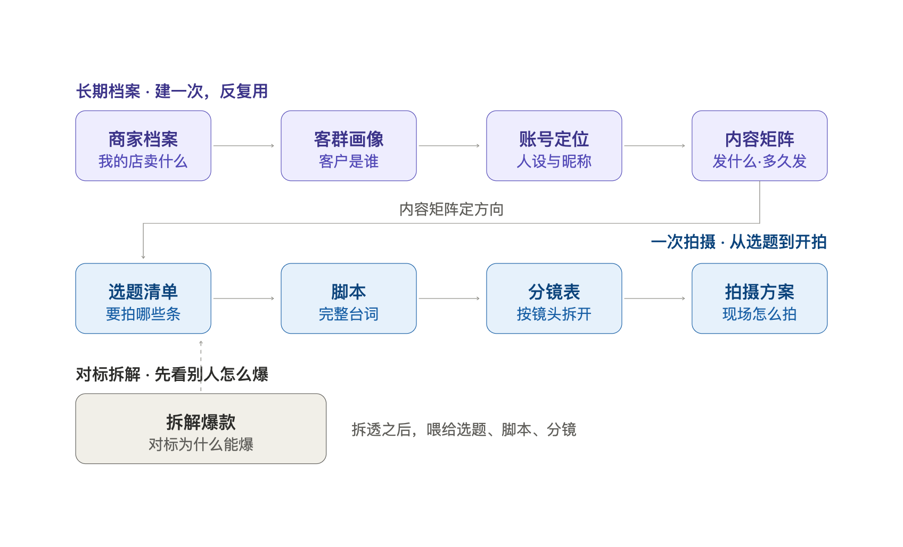

# reelwright 🐰

> Reels, written right. · 匠人出手，片片对味

[](LICENSE)
[](https://claude.com/claude-code)

**给自媒体人的短视频生产工具：从拆对标到开拍，一条流水线跑完。**

旅拍、妆造、民宿，独立摄影师、独立妆造师——这些本地生活里的内容生产者，最缺的不是相机和审美，而是一套能稳定、批量出内容的流程：今天发什么、文案怎么写、镜头怎么拆、怎么把一条爆款的拍法换成自己的店。拍一条不难，天天拍、条条像人话，才难。

**reelwright 就是这套流程。** 九个方向做成可单独用、也能串成流水线的工序——第一个「拆解爆款」先拆透对标，后面八个从「商家档案」一路走到「拍摄方案」，配一个叫 **灵小兔 🐰** 的小助手带你走。内置「证据边界」「分层保留」「去 AI 味」三套方法，每步产出落成 Markdown 文件、上游喂下游，最后拿到的是能直接开拍的脚本、分镜表和拍摄方案，不是空话。



---

## 你只要说一句话

> 帮我给一家三亚的海景民宿，起个号、做一批选题、写第一条脚本。

灵小兔就顺着这条线带你走：

**商家档案**（你是谁）→ **客群画像**（客户是谁）→ **账号定位**（抖音/小红书/视频号的人设）→ **内容矩阵**（各账号发什么）→ **选题**（拍什么）→ **脚本**（怎么写）→ **分镜**（怎么拍）→ **拍摄方案**（怎么执行）。

每一步的结果都落成一个 Markdown 文件，下一步直接接着用。最后拿到的，是能直接开拍的脚本、分镜表和拍摄方案，不是 PPT 上好看的空话。

---

## 为什么值得用

**1. 去 AI 味，台词逐字可念。** 内置一整套「去 AI 味」规范（5 条核心原则 + 24 种 AI 痕迹），写出来的台词像人说话，不是广告腔。看一眼区别：

> 常见的 AI 腔：这不仅是一次汉服体验，更是对传统文化的致敬，展现了东方美学的独特魅力。
>
> 灵小兔写的：妆造师往我头上别最后一根发簪的时候说，穿汉服别绷着，走路带风才好看。我试了试，裙摆真的会跟着人跑。

**2. 工序化，不是靠灵感的聊天。** 每个方向有明确的输入和产出，一问一答走完一道工序；答不上也没关系，给选项、给示例。做出来的东西可复用、可沉淀，不用每次从头拍脑袋。

**3. 产出是文件，不是聊天记录。** 每一步落成 Markdown，上游喂下游，能改、能导出、能发给团队或外包。

**4. MIT 开源，免费。** 拿去用、拿去改、拿去商用都行。

---

## 九个方向

每个方向都能单独用。跟灵小兔说一句话，它就帮你干一件事、给出一份能落地的产出：

**1. 拆解爆款** —— 把对标视频的口播稿/评论区丢给它，问「这条为什么爆、怎么换成我的店」→ 得到 `爆款拆解.md`（爆款规律 + 可套用的脚本/分镜模板）

**2. 商家档案** —— 跟它聊「你是谁、卖什么、优势在哪」→ 得到 `商家档案.md`（长期档案，之后反复复用）

**3. 客群画像** —— 说「帮我搞清楚客户是谁、为什么来」→ 得到 `客群画像.md`（核心/潜在客群 + 打动点）

**4. 账号定位** —— 说「帮我在抖音/小红书/视频号起号、定人设」→ 得到 `账号定位.md`（人设 + 昵称 + 简介）

**5. 内容矩阵** —— 说「各账号发什么、多久发一次」→ 得到 `内容矩阵.md`（内容支柱 + 类型配比 + 更新频率）

**6. 选题策划** —— 说「给我一批能拍的选题」→ 得到 `选题清单.md`（10-20 个可直接开拍的选题）

**7. 脚本撰写** —— 说「写一条 30 秒的开店脚本」→ 得到 `脚本.md`（完整可拍脚本，台词去 AI 味）

**8. 分镜设计** —— 说「把脚本拆成分镜表」→ 得到 `分镜表.md`（现场可执行的镜头表）

**9. 拍摄方案** —— 说「排一下拍摄安排」→ 得到 `拍摄方案.md`（场景/道具/人员/时间，照着就能执行）

方向 2-5 是「长期档案」，沉淀下来反复复用；6-9 是「一次拍摄」的产出；第 1 个「拆解爆款」先拆对标，喂给选题、脚本和分镜。

---

## 怎么做到的（方法论 + 工具）

**1. 九个方向一条流水线。** 第一个「拆解爆款」先把对标视频拆透，后面八个从「商家档案」一路走到「拍摄方案」，每一步产出落成文件、上游喂下游，不重复采集、不凭空起稿。

**2. 拆解有证据边界，不脑补。** 拆对标视频时先定「拿到了什么」——本地视频已抽帧转写、画面截图、口播稿、还是用户口述——再决定能拆多深，只拆拿到手的内容，不凭空脑补镜头、动作、数据。

**3. 换皮用「分层保留策略」。** 把一条视频拆成时间轴、运镜、转场、字幕时机、声音卡点、视觉（人物/服装/场景/产品）等可控层，每层单独标记 保留 / 沿用 / 替换 / 删减，做到「拍法不变、只换人换店」，而不是笼统照抄。

**4. 文案像人说的。** 内置「去 AI 味」规范（5 条核心原则 + 24 种 AI 痕迹速查），台词、旁白、字幕逐字可念。

**工具链**——本地视频先转成帧图 + 字幕，灵小兔再据此拆解：

| 工具 | 作用 |
|------|------|
| `scripts/video_to_frames_transcript.sh` | 本地对标视频 → ffmpeg 抽帧 + whisper/mlx_whisper 转写，产出帧图 + 字幕；带 `--check` 自检 |
| `scripts/verify.sh` | 一键校验 skill 结构、文件引用、frontmatter 是否完整 |

---

## 最快上手（零部署，不用下载）

不会下载、不会部署也没关系。把下面这个链接发给任意 AI（ChatGPT、Kimi、DeepSeek、豆包、通义等），让它先读，再把你对店铺的描述和需求告诉它，就能用：

```
https://raw.githubusercontent.com/janieehe/reelwright/main/PROMPT.md
```

- 完整提示词都在这个文件里（九个方向的全部规范），AI 读完就能扮演「灵小兔」干活。
- 产出的脚本、分镜、方案，AI 会以 Markdown 正文输出，你复制存成 `.md` 即可。
- 想拆对标视频，直接把口播稿 + 截图贴给它（它看不了视频本体）。

> 下面「安装」是给想把它装成本地 skill（Claude Code）的人用的完整步骤。

---

## 安装（Claude Code）

### 前置条件

- 已安装 [Claude Code](https://claude.com/claude-code)。

### 1. 获取代码（二选一）

```bash
git clone https://github.com/janieehe/reelwright.git
```

或在仓库页点 **Code → Download ZIP** 下载，解压后把 `reelwright-main/` 重命名为 `reelwright/`。

### 2. 放进 skills 目录

把整个 `reelwright/` 目录放进：

- 个人全局：`~/.claude/skills/reelwright/`
- 或项目级：`你的项目/.claude/skills/reelwright/`

> 目录名必须是 `reelwright`（不能是 `reelwright-main` 之类），否则 skill 加载不上。

### 3. 开始用

建一个工作目录（比如你的店铺项目文件夹），对灵小兔说一句人话：

> 帮我给民宿/旅拍店起个号、做一批选题、写第一条脚本。

顺着九个方向走，产出会以 Markdown 文件的形式落在当前目录。

---

## 验证安装

装好后跑一次自检，确认结构完整、引用一致：

```bash
bash scripts/verify.sh
```

通过会输出 `自检通过`；有问题会逐条列出。

## 示例

- **走查示例**：`examples/山海间旅拍/` 一套用「山海间旅拍（三亚旅拍店）」跑通的完整走查，8 份档案从商家档案一路串到拍摄方案。同行先看一遍，就知道灵小兔最终会产出什么；想二改的人拿它当输出格式参照。

---

## 目录结构

```
reelwright/
├── SKILL.md              ← 灵小兔人设 + 九个方向总览 + 路由
├── PROMPT.md             ← 合并好的完整提示词（零部署用，贴给任意 AI）
├── README.md             ← 本文件
├── LICENSE               ← MIT
├── assets/
│   └── workflow.png      ← 九个方向流程图（README 配图）
├── scripts/
│   ├── verify.sh                     ← 结构自检脚本
│   └── video_to_frames_transcript.sh ← 本地视频抽帧+转写（可选，拆爆款用）
├── examples/
│   └── 山海间旅拍/        ← 一套完整走查示例（8 份档案）
└── references/
    ├── 00-全局规范.md     ← 提问阶梯、去 AI 味、落盘、合规
    └── 01-拆解爆款.md … 09-拍摄方案.md
```

## 工作原理（给想二改的人）

- **渐进式披露**：主 SKILL.md 只放总流程与路由，九个方向详细规范按需读取，省 token。
- **文件即档案**：所有产出都是 Markdown，没有 JSON、没有隐藏结构，上游写、下游读。
- **说人话**：对话里只呈现成品，不暴露机器结构。

---

## 致谢

- 拆解工程方法借鉴自 [sugarforever/boring-video-studio](https://github.com/sugarforever/boring-video-studio)（节拍结构化，MIT）。
- 去 AI 味规范融合自 [op7418/Humanizer-zh](https://github.com/op7418/Humanizer-zh)（翻译自 [blader/humanizer](https://github.com/blader/humanizer)），遵循原项目许可。

---

**English:** reelwright is a short-video production tool for self-media creators in local-life businesses — travel-photography studios, styling studios, homestays, and independent photographers & stylists. Nine directions chain from a hit-breakdown tool (reverse-engineering benchmark videos and comment sections) through profile, topics, scripts, storyboards, to a shoot plan, producing human-sounding, ready-to-shoot files. MIT licensed.
